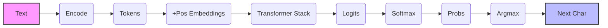

# NumPy mini-transformer

Данный проект представляет собой мини реализацию трансформеров на базе чистого numpy. Проект был создан в образовательных целях, чтобы продемонстрировать внутреннюю мат. реализацию трансформеров, без использования заготовок на Торч и тензерфлоу

Особенностью моего проекта являются:
- **Чистый NumPy**: все внутренние алгоритмы начиная с LayerNorm и Multi-Head Attention заканчивая Feed-Forward блоков, реализована на матричных операциях
- **Safe Softmax**: реализована защита от числового переполнения при расчете экспонент
- **causal masking**: треугольная маска которая запрещает модели смотреть в будущее при обучении и генерации

## Структура проекта:

- `config.py` - конфигурация гиперпараметров модели
- `tokenizer.py` - символьный токенизатор, кодирующий текст в индексы и обратно
- `embeddings.py` - создание и суммирование токеновые и позиционные эмбидинги
- `layers.py` - математическое ядро в котором идет рассчет внимания, маскирования и нормализации слоев
- `block.py` - объединение внимания и feed-forward слоев в один трансформер блок
- `model.py` - сборка стека блоков и финальные логиты
- `main.py` - инициализация случайных весов, загрузка текста и предсказание следующего символа

## Архитектура пайплайна
Входной текст обрабатывается по данной цепочке операций:

## Быстрый старт

Запуск:
У вас должен быть установлен numpy перед запуском:
```bash
PYTHONPATH=. python3 main.py
```
при запуске модель инициализирует случайные веса и выбирает случайный кусок текста из файла, провезет его через трансформер и выдаст предсказание для следующего символа
как пример:
```bash
ibrokhim@ibrokhim:PYTHONPATH=. python3 main.py
49
все загрузилось наверное, длинна текста  7348
уникальных символов в тексте  ['\n', ' ', '"', "'", ',', '-', '.', ';', 'A', 'B', 'C', 'E', 'H', 'I', 'J', 'L', 'O', 'S', 'T', 'U', 'W', 'Y', 'a', 'b', 'c', 'd', 'e', 'f', 'g', 'h', 'i', 'j', 'k', 'l', 'm', 'n', 'o', 'p', 'q', 'r', 's', 't', 'u', 'v', 'w', 'x', 'y', 'z', '—', '’']
тестовый текст---------------------  ands attention a
логиты последнего токена-----------  [-1.18215099e-02 -6.46997169e-03 -1.60415721e-01  5.91130851e-02
 -1.33810418e-01 -1.21397128e-01  1.68072638e-04  2.82417695e-02
  3.10786096e-01 -5.69131814e-02  1.11848453e-01  1.37708162e-01
 -3.59649074e-02 -3.87628632e-02  7.76242723e-03 -1.62362158e-01
  6.01650635e-02 -1.58713476e-01 -2.07880841e-01 -8.65924853e-02
  1.01610160e-01  1.12302900e-02  5.74404599e-02  1.33834237e-01
  1.43413908e-01  1.77718506e-02  1.32721682e-01  1.68392465e-01
 -7.97247381e-03  1.30543517e-01 -7.93989147e-02  2.50163055e-01
 -6.69606121e-02  1.29210932e-01 -1.06996830e-01 -8.37464286e-02
  6.98322118e-02  3.43537030e-02 -1.53007965e-01  2.41537979e-02
 -1.55845785e-01 -2.31598163e-01 -1.10969326e-01  5.10059668e-02
  1.28713792e-01  7.61365571e-03 -2.03390688e-01  9.35014755e-03
 -2.40856851e-01  3.53632498e-02]
вероятности последнего токена------  [0.01971949 0.0198253  0.0169966  0.02116909 0.01745487 0.01767289
 0.01995734 0.02052556 0.02722716 0.01885005 0.02231541 0.0229
 0.01924909 0.01919531 0.02010948 0.01696355 0.02119137 0.01702556
 0.0162087  0.01829882 0.0220881  0.02017934 0.02113371 0.02281146
 0.02303104 0.02031178 0.0227861  0.02361357 0.01979554 0.02273652
 0.01843093 0.0256256  0.01866161 0.02270624 0.01792923 0.01835097
 0.02139722 0.02065139 0.01712297 0.02044182 0.01707445 0.0158288
 0.01785814 0.02099816 0.02269496 0.02010649 0.01628164 0.02014143
 0.01568292 0.02067225]
предсказанный следующий символ-----  B
```

У проекта есть еще много недостатков, но надеюсь на пулл реквесты и форки :)
